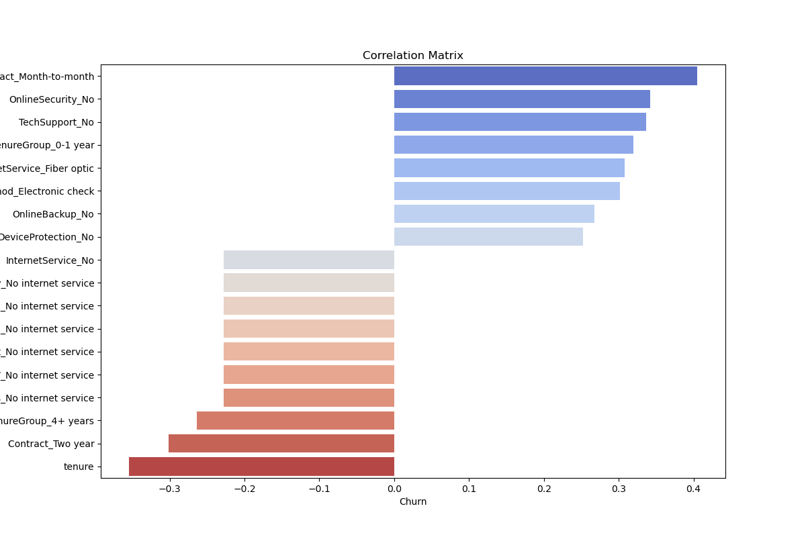

## 📊 Project Overview
This project focuses on prediticting and analyzing customer churn for a subscription-based service using a publicly available dataset. 
It combines data cleaning, EDA, and Machine Learning to generate actionable insights for reducing churn and imporving customer retention

## Objectives
-   Clean and prepare the dataset
-   Idenity key facotrs contributuing to customer churn
-   Build predictive models to forecast churn risk
-   Generate insights and recommendations for multiple business roles

## 📈 Key Insights

-   Month-to-Months customers are 3 times more likely to churn than long term ones
-   Customers without support services (like tech and security) are more likely to churn
- Churn is highest within the first year of service
- Customers paying with electronic check (autopay) churn more than other methods

## Recommendations
- Offering incentives for long-term sign up (large discounts for two year signup when creating contract)
- Bundling support services in tier plans
- Find ways to ease customers in with thier first 12 months

## Skills 
### 🧠 Key Skills Demonstrated
-   Data Cleaning and Feature Engineering (Pandas, Numpy)
-   EDA and Visualization (Seaborn, Plotly)
-   Predictive Modeling (Scikit-learn, logistic regression, random forest)

## 🗃️ Dataset
**Source**: [Telco Customer Churn - Kaggle](https://www.kaggle.com/datasets/blastchar/telco-customer-churn)  
-   Contains ~7,000 customer records with demographic service usage, contracts, and churn label.

### 🛠️ Tools & Technologies
-   Python
-   Pandas, NumPy, Scikit-learn, Seaborn, Mathplotlib, Plotly
-   Git, GitHub

### 📁 Project Structure
/data           # Raw and cleaned data
/notebooks      # EDA, modeling, insights
/scripts        # Reusable Python code
/reports        # EDA profiles, summary reports
/images         # Visualizations for documentation

### 📎 Links -
- #### 📁 [Project Repository](https://github.com/corymu/data_analysis)

#### Dataset
[Telco Customer Churn - Kaggle](https://www.kaggle.com/datasets/blastchar/telco-customer-churn)